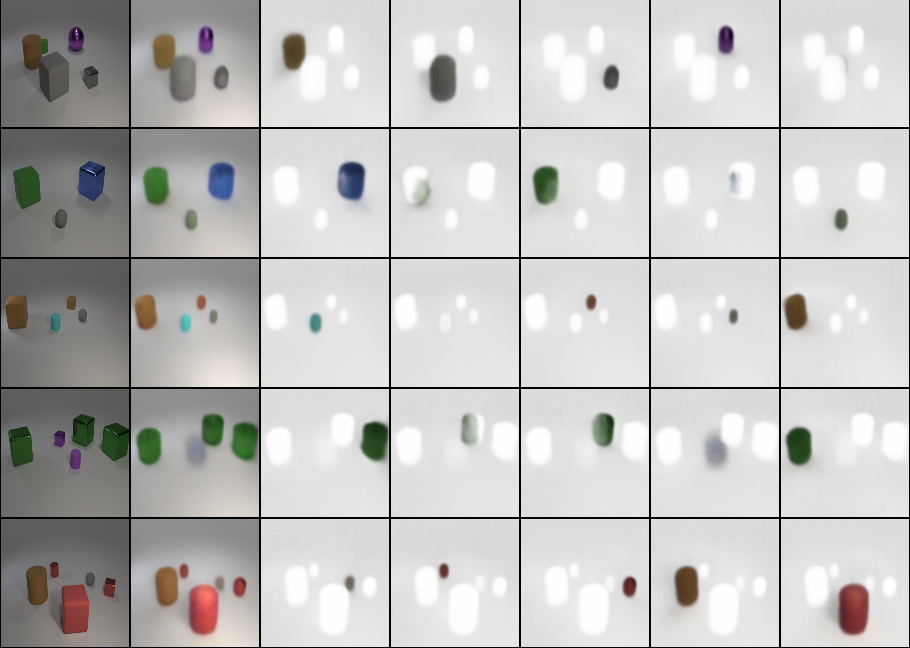

# Slot Attention

This is a re-implementation of "Object-Centric Learning with Slot Attention" in PyTorch (https://arxiv.org/abs/2006.15055).



## Requirements

- [Poetry](https://python-poetry.org/docs/)
- Python >= 3.8
- PyTorch >= 1.7.1
- Pytorch Lightning >= 1.1.4
- CUDA enabled computing device

Note: the model was run using a Nvidia Tesla V100 16GB GPU.

## Getting Started

Run `run.sh` to get started. This script will install the dependencies, download the [CLEVR](https://cs.stanford.edu/people/jcjohns/clevr/) dataset and run the model.

## Usage

```bash
python slot_attention/train.py
```

Modify `SlotAttentionParams` in `slot_attention/train.py` to modify the hyperparameters. See `slot_attenion/params.py` for the default hyperparamters.

### Logging

To log outputs to [wandb](https://wandb.ai/home), run `wandb login YOUR_API_KEY` and set `is_logging_enabled=True` in `SlotAttentionParams`.

## Acknowledgements

Special thanks to the original authors of the paper: Francesco Locatello, Dirk Weissenborn, Thomas Unterthiner, Aravindh Mahendran, Georg Heigold, Jakob Uszkoreit, Alexey Dosovitskiy, and Thomas Kipf.
